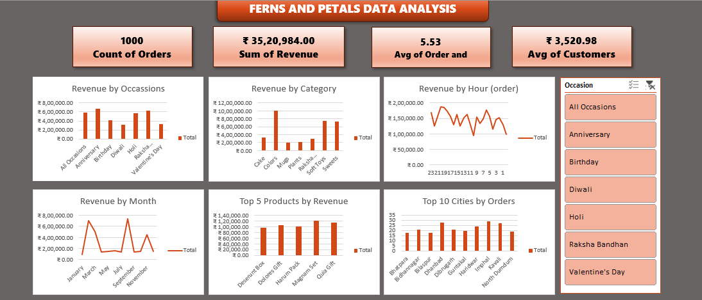

# Ferns and Petals Sales Analysis Dashboard (Excel)

## Project Overview
This project showcases a dynamic Excel dashboard analyzing sales for a fictional gifting business modeled after Ferns N Petals. The goal is to uncover trends in customer behavior, revenue, product performance, and city-wise orders using interactive visualizations.

## Tools & Techniques
- Microsoft Excel  
- Pivot Tables and Pivot Charts  
- Slicers for interactivity  
- Conditional Formatting  
- Dashboard Design Principles

## Key Metrics
- Total Orders: 1,000  
- Total Revenue: ₹35,20,984  
- Average Order Value: 5.53  
- Average Revenue per Customer: ₹3,520.98  

## Dashboard Highlights
- Revenue by Occasion: Diwali and Anniversary contribute the most
- Top Categories: Cakes, Sweets, Soft Toys
- Revenue by Hour: Peak activity during 11 AM to 5 PM
- Monthly Trends: Highest sales in July and March
- Top Products: Dessert Box, Quirk Gift, Mug+Plant Set
- Top Cities: Ghaziabad, Pune, Hyderabad, Delhi

## Dashboard Snapshot

## Skills Demonstrated
- Business Intelligence Reporting  
- Data Exploration and Visualization  
- Analytical Thinking with Excel  
- Sales Pattern Interpretation

## Files Included
- Ferns-and-Petals-Dashboard.xlsx – Main Excel file  
- Screenshot.png – Dashboard image  
- README.md – Project documentation  
- Ferns_and_Petals_Summary.pdf – Detailed project summary

## Note
This is a learning project using dummy data for skill demonstration purposes.
